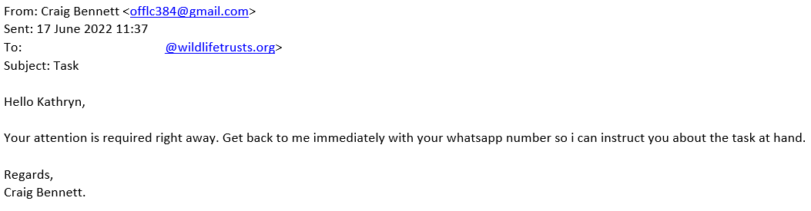

# Business Email Compromise

# Context
The National Cyber Security Centre (NCSC, part of GCHQ) has warned[^1] of a rise in Business Email Compromise (BEC) attacks. BEC is a digital scam whereby cyber criminals contacts through email spoofing or compromised legitimate email accounts. Their aim is to deceive a victim into making a payment and/or handing over sensitive information.
 
# Real world example
We have seen an example of this recently where an email was sent, purporting to be from our Chief Executive to a senior manager

In this case the senior manager recognised this was not from who it claimed to be from (as the email address was a generic gmail.com address) and there was no compromise.  However, had they been engaged they could have been tricked into making some kind of payment or inadvertently allowing the attacker access to sensitive information.
 
The NCSC warns that if ransomware becomes more difficult ransomware cyber crime groups may adopt BEC as a tactic, and bring their more sophisticated tools and infrastructure to bear, increasing the threat even further.  Advice on how to deal with this can be found in the NCSC guidance (below) and they also have a helpful infographic you can share with staff.

[^1]: [NCSC Guidance](./BEC%20Threat%20June%202022.pdf)