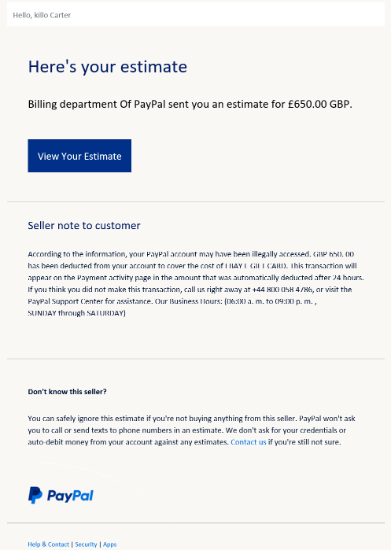
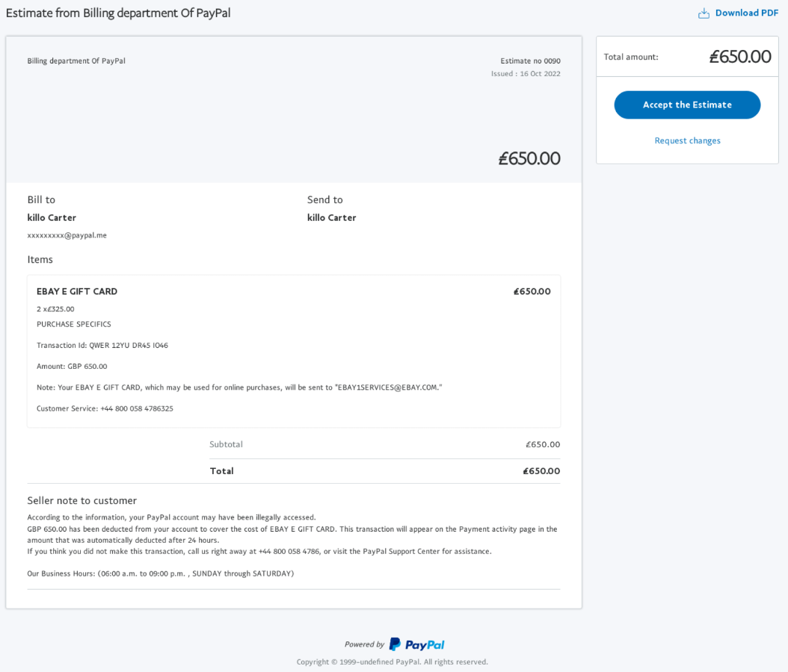
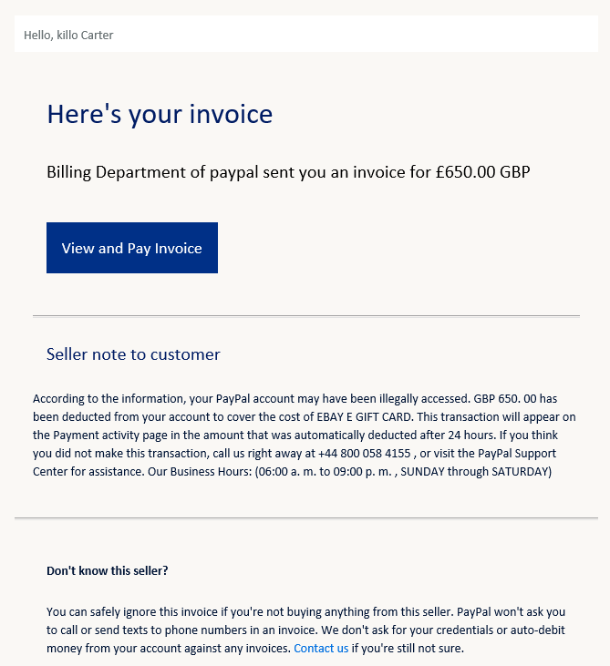

# Paypal scams

There's been a rise in PayPal scams which are quite hard to spot because they come from legitimate PayPal servers.  They're suspected to be from compromised PayPal Business accounts, or accounts setup purely for the purpose of fraud.

The initial email subject is "Estimate from Billing department Of PayPal (0090)" which contains a link to an invoice which is legitimate (in that it's a real invoice raised on PayPal) but malicious in that it's not for something the recipient has ordered and received.

Screen shots of the emails below, other than the unsolicited nature of the emails the only other indicator of malicious intent was the 0800 number on the invoice which isn't PayPal (it's registered to Colt Technology).  Both PayPal and Colt have been notified of the scams.

