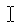

# Evidence of increased risk
 
There have been several events recently which indicate an increased risk of phishing attack on Wildlife Trusts.  This is based partly on open source information (blogs from Microsoft, Mandiant, NCC Group and others), partly on intelligence from the NCSC Charity Sector Trust Group and partly from what we've observed at RSWT over the last two weeks. There are three key trends observed, each with their own risks and mitigations.

# Compromised accounts in partner organisations
In February and March the federation saw a spate of phishing attacks which attempted to spread to multiple Wildlife Trusts.  Similar activity has recently been seen in other parts of the non-profit sector, with compromised accounts at partner organisations and suppliers leading to convincing phishing emails.  In the last 48 hours we have seen two phishing from a valid contact of RSWT which used restricted access DropBox documents to bypass detection technology.

## Advice for technical staff
Do not rely on spoofed emails and allow-lists to defend against phishing, and in training for staff stress that a phishing email could come from a trusted contact, and to treat all unsolicited links which request authentication with a degree of suspicion.

## Advice for everyone
Be extremely cautious when prompted authenticate to Microsoft after clicking on a document or link when you're already using Outlook (Exchange Online), SharePoint Online, Teams and OneDrive for Business.

# Attacker-in-the-middle (AiTM) bypassing multi-factor authentication (MFA)
Unfortunately MFA on its own is no longer guaranteed to protect against phishing attacks.  MFA still cuts your risk by more than 90%, but off-the-shelf toolkits like EvilGinx have now deskilled bypassing MFA by proxying authentication and stealing session cookies. We may have seen a successful MFA bypass in the federation earlier this year (to be confirmed) and we have seen an attempt at AiTM on RSWT in the last week.

## Advice for technical staff
Consider additional protection on top of MFA, for example phishing resistant authentication,

- Windows Hello for Business
- FIDO2 authentication 

.. and/or Conditional Access policies,

- Token Protection for Sign-In Sessions for Outlook
- Continuous Access Evaluation CAE
- Require device to be marked as compliant
- Require device to be marked as Hybrid Azure AD joined device.

# Image based phishing emails
Detecting phishing emails often relies on analysis of the different email artifacts, including text, images, URLs and documents. To make this harder recent phishing campaigns use only a single image and URL, reducing the number of artifacts to analyse and therefore making detection harder.  These images are effectively a screen capture of an email body, and recent examples include DocuSign emails, and various Microsoft authentication themes (e.g. QR codes to authenticate or reset your password).

## Advice for technical staff
These are extremely difficult to detect using custom rules, but your anti-phishing protection vendor (Microsoft, Mimecast etc.) should be tracking these and using the file has for the image to detect and block or retrospectively remove phishing emails/block links.

## Advice for everyone
Normally an email contains text and links.  When you hover over text you get the text select mouse pointer , and when you hover over a link you get the hand mouse pointer .  If you never see the text select mouse pointer, the email is just one image with a link, and should be reported to IT.