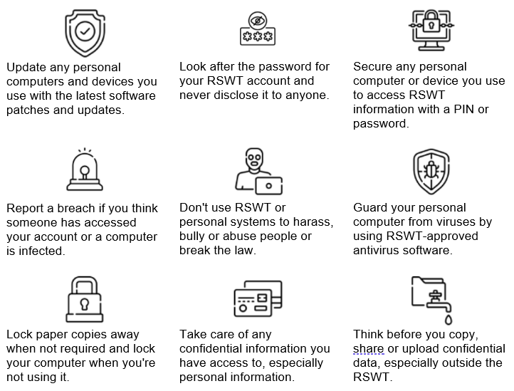

# Purpose
This policy sets out the conditions of use for Royal Society of Wildlife Trusts (RSWT) computers and systems, including applications used on personal devices, to protect those systems and the information stored on them for which the RSWT is legally responsible. Adherence to this policy is mandatory and non-compliance could lead to disciplinary action.
If you need any help complying with this guidance (for example technical assistance) please contact ICT.
# Personal use
RSWT systems exist to support and enable the aims of the RSWT. A reasonable amount of personal use is allowed. However, it must not cause damage or disruption to computers or networks, or any damage or distress to others.
In a home working environment, you are responsible for ensuring RSWT equipment and the data stored on it are protected from access by family, friends, and visitors.
## Personal data
Unless specifically marked as ‘Personal’, all data stored on systems managed by the RSWT is considered to be work-related. As such it does not constitute personal information, which is protected under Human Rights legislation, and therefore may be accessed by authorised staff with due authority.
## Monitoring auditing and control
The RSWT reserves the right to monitor use of IT systems and data, audit networks and systems and implement technical controls. We do this to secure data and systems, and to protect the safety of other users. All monitoring and auditing is conducted in compliance with UK legislation.
# Awareness and training
To ensure you aware of the risks of data breaches you must complete a mandatory information security awareness course at the beginning of their employment with the RSWT, and any refresher training courses assigned to you during your employment.
# Reporting security events
If you think your computer or a RSWT computer is infected with a virus, your account password is known by someone else, or you believe information is at risk for any other reason, you should immediately report this as breach by contacting ICT. There is no penalty for reporting something which turns out not to be legitimate, so if in doubt, report it.
# Protecting information
You should take care of any RSWT information you have access to including your own work, and protect it against unauthorised disclosure, modification, or destruction. Here are three simple steps you can take to protect your identity and your work:

1. **[Look after](https://www.getsafeonline.org/personal/articles/passwords/)** the password for your RSWT account. You must never disclose your password to anyone (including IT staff who will never ask you for your password).
2. **[Update](https://rswt.sharepoint.com/sites/IT/SitePages/Staff-Information-Security-'how-to'.aspx#update-any-personal-computers-and-devices)** any personal computers and devices you use to access RSWT information with the latest software patches and updates and protect your computer using up to date anti-virus software.
3. **[Secure](https://rswt.sharepoint.com/sites/IT/SitePages/Staff-Information-Security-'how-to'.aspx#update-any-personal-computers-and-devices)** any personal computer or device you use to access RSWT information with a PIN or password. This makes it harder for someone to access your personal information or RSWT information if your device is lost or stolen.

# Mobile devices and remote working
Because information on portable devices such as laptops, tablets and smartphones is especially vulnerable, special care should be exercised with these devices. You will be held responsible for the consequences of theft of or disclosure of information on portable devices you use for work if you have not followed the precautions set out in this policy.
# Restrictions on software installation
To prevent infection by malicious software (viruses and trojans) installation of software is managed by the IT team.  If you need a specific application to do your work, please contact IT who will arrange for it to be installed.
If you use personal devices to access work data, take particular care to only install software from legitimate sources (e.g., the Google, Microsoft and Apple app stores or websites).
# Clear desk and clear screen
Hard copy confidential data should be locked away when not required, especially when you are not in your office or remote working space.
Computers you use to access RSWT systems and data should be secured with a ‘lock-on-idle’ policy after (at most) 10 minutes of inactivity (your work computer will be configured this way for you). In addition, the screen and keyboard should be manually locked whenever leaving the computer unattended.  Take particular care if you are working with sensitive personal data at home, to prevent inadvertent disclosure to others in your household.
# Information transfer
You must not send, upload, remove on portable media or otherwise transfer to a non-RSWT system any information that is Strictly Confidential except where authorized by your line manager or the information asset owner.
RSWT systems are those which you were provided access to as part of your inductions.
# Unacceptable use
All users should use their own judgement regarding what is unacceptable use of RSWT systems. Below are some examples of unacceptable use of RSWT systems. This list is not exhaustive, and when using RSWT systems, you should bear in mind the terms and conditions of your employment contract, the RSWT Equality, Diversity and Inclusion Policy, and ultimately the interests and wellbeing of colleagues, volunteers and the general public. 
Examples of unacceptable use of RSWT IT systems;
- Creation or transmission of material (including via social media) which is defamatory and could constitute harassment or bullying, or simply intends to cause annoyance, inconvenience or needless anxiety.
- Communication which could constitute emotional abuse or sexual violence (including the non-consensual sharing of indecent or sexual images). 
- Creation or transmission of material with the intent to defraud. 
- Creation or transmission of material such that this infringes the copyright of another person.
- Deliberate unauthorised access to networked facilities or services.
- Illegal activity including, but not limited to, accessing pornographic images or sites or media which are specifically designed to promote terrorism, or which advocates or promotes any unlawful act.
- Any activity which jeopardises the security, integrity, performance, or reliability of RSWT IT systems including the introduction of malware or attempting to disrupt or circumvent IT security measures.
- Any activity which brings the RSWT into disrepute.    

# Information classification
You must handle RSWT information according to the instructions below. RSWT information is classified based on its level of sensitivity and its value to the RSWT, and that classification then determines how you should store, process and transfer that data. You should take particular care to handle Personally Identifiable Information (PII) in accordance with the classification below and the RSWT Data Protection Policy.
Classification levels
Classification is based on the level of sensitivity and the impact to the RSWT if the confidentiality, integrity or availability of the information is compromised.  There are three classification levels;

1. Public (Low sensitivity, minimal impact)
2. Internal only (moderate sensitivity, moderate impact)
3. Strictly confidential (high sensitivity, serious impact)

|   | Public | Internal Only | Strictly Confidential |
| - | ------ | ------------- | --------------------- |
Security Impact| Low| Moderate| Serious
Description| Information should be classified as Public when the unauthorised disclosure, alteration or destruction of that information would result in little or no risk to the RSWT.| Information should be classified as Internal Only when the unauthorised disclosure, alteration or destruction of that information would result moderate risk to the RSWT.| Information should be classified as Strictly Confidential when unauthorised disclosure, alteration or destruction could result in either personal (or sensitive personal) or legally privileged information being divulged; this equates to RSWT being at risk from Information Commissioner’s Office sanctions under the Data Protection Act 2018 and should be considered as a high risk.
Examples| Press releases, publications, campaign communications.| Internal documents and emails of a non-confidential nature; collaborative documents of a non-confidential nature.| Payroll; disability, health and wellbeing information; emergency contact details; notes relating to disciplinary processes; commercially sensitive business operations and strategies.
Access Control| Unrestricted| Viewing and Modification restricted to RSWT staff or authorised volunteers. Not intended for the public.| Limited to RSWT staff and partner organisations, as authorised by Information Asset Owners (or their delegate) on the basis that the individual requires such access in order to perform their job (‘need-to-know’).
Storage| No restrictions| Store on encrypted personal devices, managed devices or RSWT cloud services. Should not be left unattended outside a secure working environment.| Store on managed devices or RSWT cloud services only. Hard copy to be kept in a locked or otherwise secured storage unless it is in use.
Transmission and Collaboration| No restrictions| Transmission or collaboration only using encrypted services.| Transmission or collaboration only using encrypted services. Any distributed documents (electronic or paper) must be watermarked as ‘STRICTLY CONFIDENTIAL’ and the intended recipients clearly indicated
Disposal| No restriction| On decommissioning of equipment used to store the information, the storage should be securely sanitised following NCSC guidelines. | On decommissioning of equipment used to store the information, the storage must be securely sanitised following NCSC guidelines. An accompanying certificate of destruction shall be obtained and stored by the person facilitating the destruction.
Training| General data protection and information security awareness training.| General data protection and information security awareness training refreshed annually.| General data protection and information security awareness training refreshed annually. Applicable policy and regulation training required.
User Devices| No restriction| Password protection required, locked when not in use. Encryption suggested.| Password protection required, locked when not in use. Encryption required.