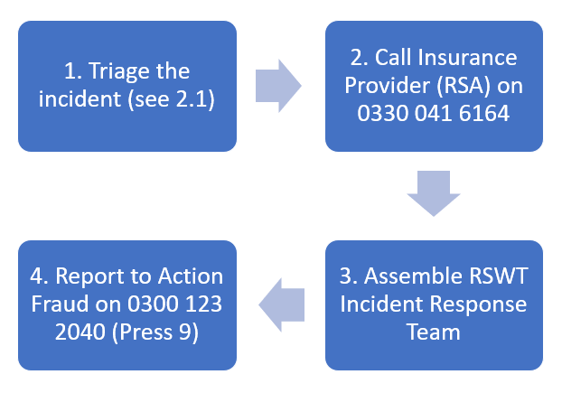
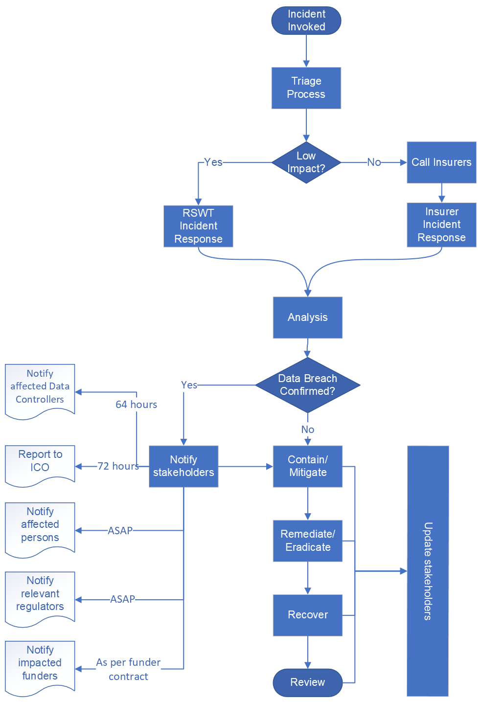

# IN AN EMERGENCY (MEDIUM OR HIGH IMPACT INCIDENT)

**In a medium or high impact incident all technical response activities will be led by the Cyber Insurance Incident Response Team. See Section 5 for more details.**

The Incident Manager (by default the Strategic Lead Information Security) co-ordinates communications, escalations and any reporting issues, pulling the whole response together.

# Introduction

This document sets out the process for managing and responding to information security incidents within RSWT, as per the IT Information Security Policy version 1.0.

## Invocation

Multiple information security **events** occur every day, and not every event is an **incident**.

A security incident is when a sequence of events has/will lead to the disclosure, modification or loss of data.

The most likely events are;

1.  Anti-virus alerts
2.  Staff reporting unusual behaviour on an account.
3.  A third party reporting suspicious emails or other activity from our network.
4.  National Cyber Security Centre (NCSC) Early Warning Service notification.
5.  Absolute Networks reporting a suspect incident.

## Recording

Once a security incident is declared it should be recorded in Jitbit,
and as the incident progresses all information gathered, decisions made,
actions taken, data captured (or missing) should be recorded within
Jitbit.

> ***Note:** If an incident has already got to the point where Jitbit is no longer believed to be a secure environment (i.e. the attackers have Active Directory administration rights) the incident would be a major or critical incident, and escalated to a third party (see Escalation section below).*

## Key Contacts

Communication is vital throughout any security incident. The table below lays out the important people who may need to be involved, and an alternative contact if they are not available. This is the RSWT Cyber Security Incident Response Team.

For any internal contacts who need to be reached for a rapid response (including out of hours) a mobile phone number is required. This is to avoid communicating over potentially compromised or disrupted communication channels.

| Role | Internal Contact | Phone |
| ---- | ---------------- | ----- |
| Incident Manager. _Oversee, communicate, engage support, escalate, notify_. | Jane Smith Operations Manager | 07725 999999 |
| Senior Management. _Escalation of serious incidents_. |   |   | 
| Data Protection. _Provide advice on Data Protection issues including ICO notification_. |  |  |
| Incident Response. _Technical incident response resource_.  |  |  |
| Legal & Insurance. _Provide advice on insurance, liability and other legal matters_.  |  |  |
| HR. _Liaison for staff disciplinary or wellbeing matters_.   |  |  |
| Internal Communications. _Communication within RSWT and TWT_.   |  |  |
| External Relations. _Communication with the media, the public_.  |  |  |
| Cyber Insurance Provider. _Incident Management, IT Forensics, Legal, PR services._  |  |  |

*Table 1 - Key Contacts*

## Management

From invocation to review the Incident Manager will;

- Oversee the technical incident response (RSWT or Insurer IR team),
- Co-ordinate communication with Key Contacts,
- Trigger escalation, and
- Initiate any reporting and notification required including regulatory, law enforcement, customers and other stakeholders.

## Communication

During an incident the following stakeholders may need to be informed about the incident or the consequences of the incident;

- RSWT staff
- Anyone whose data has been disclosed
- Wildlife Trusts
- Suppliers (particularly cloud service providers)
- Funders (especially where our contract requires us to notify them of   an incident)
- Regulatory bodies (the Information Comissioners Office)
- Law enforcement (Action Fraud)

Communication with these stakeholders will be undertaken by the appropriate Key Contact.

## Process

Following is a flowchart showing the Incident Response Process from beginning to end, including the key communication points and regulatory requirements.

# Triage

The first stage of an incident is triage, where the Incident Manager and Technical Incident Response Team determine the type and severity of the incident, which determines what happens next.

Triage needs to be quick, so you are only looking to gather as much information as is required to identify the type and take an *initial assessment* of the severity (this will probably change as the response progresses). If there is a suspected data breach report/record it as a suspected breach and then validate it in the next stage.

**Incident type** would typically be one or more of the following attacks;

- Phishing (including spear phishing, whale phishing, vishing etc.)
- Malware infection (including ransomware)
- Denial of Service
- Insider (malicious or accidental incident caused by a member of staff)

**Incident severity** follows the RSWT Risk Framework of Low, Medium or High, see examples below.

| Descriptor | 1 (Low) | 2 (Medium) | 3 (High) |
| ---------- | ------- | ---------- | -------- |
| Example | Compromised non-privileged account, loss of non PII data, outage of a one or two non-critical systems. | Compromised privileged account, loss of PII (<500 persons) or other valuable or sensitive data, short term (1-10 days) outage on multiple systems or one critical system. | Large scale loss of PII (500+ persons) or other sensitive or valuable data judged to be a significant breach of DPA, extended loss (10+ days) of multiple critical systems. |

*Table 2 - Incident Severity*

Having determined the type and severity of the incident during the triage process you can then determine whether to escalate, and how to respond.

## Escalation

An incident can be escalated (or de-escalated) at any time. Escalation determines who is **responsible** for making decisions during the incident, who is the most senior person **informed** about the incident whilst it is active, and which team is running the **technical incident response**.

For Medium and High Impact incidents where an insurance claim is more likely the Cyber Insurance Incident Response Provider will run the response (with support from RSWT ICT).

| Descriptor | 1 (Low) | 2 (Medium) | 3 (High) |
| ---------- | ------- | ---------- | -------- |
| Responsible | Head of IT | Director of Business Services | Deputy Chief Executive |
| Informed | Director Business Services | Chief Executive | Chief Executive |
| Incident Response | RSWT ICT | Cyber Insurance Incident Response Provider | Cyber Insurance Incident Response Provider |

*Table 3 - Escalation Matrix*

# RSWT Technical Incident Response

In low impact incidents the RSWT ICT Team will handle the four stages of incident response; analyse, contain/mitigate, remediate/eradicate and recover.

## Analyse

In this stage you are looking for evidence of compromised accounts or systems. Sources of information include;

- **Compromised accounts**
  - Azure Sign-In Events Blade
    (<https://portal.azure.com/#blade/Microsoft_AAD_IAM/SignInEventsV3Blade>)
  - Azure Identity Protection Blade
    (<https://portal.azure.com/#blade/Microsoft_AAD_IAM/IdentityProtectionMenuBlade/Overview/>)
  - Domain Controller Security Event Logs (for logon events).
  - Vmware authentication logs (see
    <https://kb.vmware.com/s/article/1021806>)
  - Mailbox activity (sent email and
    <https://security.microsoft.com/viewalerts> for new forwarding/redirect rules)
  - File activity
    (<https://admin.microsoft.com/Adminportal/Home?#/reportsUsage/OneDriveSiteUsage>
    and
    <https://admin.microsoft.com/Adminportal/Home?#/reportsUsage/SharePointActivityV1>)

- **Compromised systems**
  - Windows and Endpoint Protection Event logs
  - Running processes and services (particularly parent-child process trees)
  - Sysinternals Autoruns output (which picks up scheduled tasks as well as Run key and other Autorun entries)

  - *For a full list see the NIST Alert (AA20-245A*[^1]*) “Recommended Artifact and Information Collection”.*

> **IMPORTANT**: Before analysing a compromised system **take the precautions below** to protect your account and other RSWT systems.

1.  If you think a system is compromised, isolate it as soon as possible by disconnecting it from any networks (put laptops into flight mode or disable the switch port or virtual network interface for servers).
2.  Do NOT turn it off (as this destroys any volatile evidence in memory), but use FTK Imager[^2] on a USB stick to capture volatile and static evidence.
3.  Once you’ve isolated the system and imaged it you can work on it to try and discover what happened.
4.  Never execute suspect executables or visit potentially malicious websites outside a sandbox (e.g. Windows Sandbox or cloud services like <https://www.hybrid-analysis.com/> or <https://any.run>). If using a cloud based analysis service be aware that the contents of any files uploaded may be publicly available after submission.

Using these sources build a picture of the sequence of events that led to the incident you’re investigating, your top priorities are to define;

1. **Scope** (how many user accounts or systems are compromised or at risk)
2. **Impact** (what types of data were or could have been accessed)?
3. **Initial point of compromise** (how did they get in?)

All this evidence should be recorded in the Jitbit incident for future reference during lessons learnt or if the incident is escalated.

If at any point during the analysis phase you discover the incident involves PII you should let the Incident Manager know immediately.

## Contain/mitigate

Once you understand the scope, impact and (ideally) initial point of compromise you can begin to contain or mitigate the attack. In a low impact incident attackers are unlikely to be active on the system, however it is always worth considering how an attacker still inside would react if their access is cut off or systems are suddenly unavailable. Bearing that in mind, the actions to contain or mitigate the attack are listed below.

1.  **Reset the password** on compromised accounts and revoke all sign-in sessions to disable access in near real time.
2.  **Change group membership** to remove or deny access to a service or data.
3.  **Change firewall rules** to block inbound or outbound access for a subnet, Geo-IP locations, or a TCP or UDP port.
4.  **Isolate end user devices** using Intune/Endpoint Manager (if enabled), physically if you are in the same location, or ask the user to disable put the laptop into flight mode and close the lid (which should hibernate the system).
5.  **Isolate servers** by disabling the virtual or physical network switch port/s or shutting the server down.
6.  **Disable on-premises services** by stopping the Windows service or process.
7.  **Isolate cloud services** in collaboration with the third party.

> **IMPORTANT**: You may need restrict access to/shutdown a service to prevent a data breach or reduce the impact. This will affect colleagues, funders and other stakeholders (e.g. website visitors). The decision to restrict access to/shutdown a service is taken by the Responsible Person (see Table 3) or their manager. 

## Remediate/eradicate

Once you are confident that you’ve contained the incident and the attackers are contained you can now move to eradication. The steps taken here are similar to those taken during containment but should be co-ordinated to ensure they happen in one step, preventing an active attacker or any persistence techniques from compromising system security.

1.  Remove all malicious software and configuration from infected systems, ideally by re-imaging the system using a current golden image, or vanilla installation with all patches and a security baseline applied.
2.  Resolve the root cause of the incident (e.g. unsecure configuration, compromised credentials or unpatched vulnerability) and validate that the resolution has been effective.

## Recover

Once all malicious software and configurations have been removed, and the root cause addressed, you can now move to the recovery phase;

1.  Any systems taken offline are brought back online
2.  Any data compromised or lost is restored
3.  Any temporary configuration changes made during containment or eradication are restored to their pre-attack configuration (including restoring user access).
4.  Communicate incident resolution to all the necessary stakeholders (e.g. SLT, RSWT staff, any suppliers or stakeholder impacted).

# Third party Incident Response

In the event of a medium impact incident involving PII or any high impact incident you call the 24/7 hotline (see IN AN EMERGENCY and Key Contacts) and you will get a callback from their incident response team. Their initial questions (which you should have answers for) will be;

1.  Date, time and location of the incident
2.  The evidence that triggered the incident (e.g. M365 Security Alerts, staff or third party report, systems going offline).
3.  The known impact (e.g. data accessed or lost, systems in scope).
4.  Current status (is the incident ongoing, or ‘live’, or has it ceased).

Once the external incident response team is engaged they will direct all technical incident response actions, with the RSWT ICT team acting under their instructions, overseen by the Incident Manager. 

This Cyber Insurer Incident Response team may ask for access to interrogate RSWT systems directly, but it’s more likely they will direct RSWT staff to do so on their behalf. Therefore, familiarity with the concepts in sections 3.1 to 3.4 above would be useful.

# Post Incident Review

After an incident has been resolved and the recover stage is completed (or sufficiently progressed to begin review) there should be a documented review of the incident and the response to it.

## Incident Review

- Could anything has been done to prevent the incident?
- Could the incident have been detected earlier?
- Are there any trends from this and other incidents or events which   might inform security improvements?

## Response Review

- Was the response effective and timely?
- Were all the right people involved?
- Were those involved sufficiently informed and empowered to make   decisions?
- Was all the data required to respond promptly and effectively   available?
- Did the processes and communications work well?

The findings from these reviews should be recorded, with any risks identified recorded in the risk log, and any actions recorded in the minutes, assigned to a named individual with a deadline for implementation.

[^1]: <https://us-cert.cisa.gov/ncas/alerts/aa20-245a>

[^2]: <https://www.exterro.com/ftk-imager>
